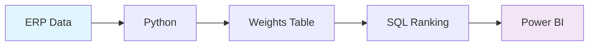

# Sistema de Ranking Global de Clientes

[](https://github.com/seu-usuario/ranking-clientes)
[]()
[](https://python.org)
[]()

> Sistema avançado de classificação e ranking de clientes baseado em múltiplas métricas de performance com base no seu desempenho em métricas-chave e pesos predefinidos.

## 🎯 Visão Geral

O Sistema de Ranking Global de Clientes é uma solução analítica que consolida **4 dimensões de análise** em um score único e objetivo para classificação hierárquica de clientes. O sistema utiliza métricas-chave por faixa de valor e pesos estabelecidos com base em regras de negócio subjetivas da gerência e direção.

### ✨ Principais Características

- 🔬 **Fundamentação Estatística**: Uso de faixas de valor predefinidas para atribuir pontos
- 📊 **7 Métricas Integradas**: Vendas, Lucro, Mix e Peso Liquido. 
- 🎯 **6 Níveis de Classificação**: (VIP), A, B, C, D e E
- ⚡ **Pipeline Automatizado**: Processamento SQL otimizado
- 📈 **Dashboards Prontos**: Especificações Power BI incluídas
- 🔄 **Modular e Expansível**: Fácil adição de novas métricas

## 🚀 Quick Start

### Pré-requisitos

```bash
python >= 3.8
pandas >= 1.3.0
scikit-learn >= 1.0.0
sqlite3
```

### Instalação

1. **Clone o repositório**
```bash
git clone https://github.com/Daltez-TI/ranking_pcpedi.git
cd ranking-clientes
```

2. **Instale as dependências**
```bash
pip install -r requirements.txt
```

3. **Configure o banco de dados**
```bash
# Ajuste o caminho no arquivo de configuração
DATABASE_PATH = "caminho/para/seu/database.db3"
```

### Uso Básico

1. **Execute a query de ranking**
```sql
-- Execute metrica_pcpedi.sql no seu banco SQLite
sqlite3 database.db3 < metrica_pcpedi.sql
```

2. **Conecte o Power BI**
```
Fonte: SQLite Database
Tabela: teste5 (resultado final)
```

## 📊 Métricas do Sistema

| Métrica              | Descrição                                      |
|----------------------|------------------------------------------------|
| **Vendas Totais**    | Volume financeiro consolidado                  |
| **Lucro Total**      | Contribuição absoluta de rentabilidade         |
| **Peso Liquido**     | Pelo liquido total (kg) dos produtos comprados |
| **Mix Produtos**     | Mix de produtos no periodo em análise          |


## 🏆 Sistema de Classificação

```
🥇 (VIP) (Top 10%)     → Clientes estratégicos
🥈 A (Top 20%)         → Clientes preferenciais  
🥉 B (Top 40%)         → Bom potencial
⭐ C (Médio Alto)      → Relacionamento sólido
📊 D (Médio)           → Oportunidade
🌱 E (Desenvolvimento) → Novo/Pequeno
```

## 🔧 Estrutura do Projeto

```
ranking-clientes/
├── source/
│   ├── pesos_estatisticos_com_pca.py    # Cálculo PCA
│   └── metrica_pcpedi.sql                       # Query principal
├── docs/
│   ├── relatorio_tecnico_consolidado.md         # Documentação completa
│   ├── fluxo_ranking.md                         # Fluxo do processo  
│   └── layout_dashboard_padrao.md               # Specs Power BI
├── dashboards/
│   └── power_bi_specs/                          # Templates BI
├── tests/
├── requirements.txt
└── README.md
```

## 📈 Fluxo de Processamento



1. **Extração**: Dados do ERP/PCPEDI
2. **SQL**: Consolidação e ranking por cliente  
3. **BI**: Visualização interativa

## 💡 Casos de Uso

### 🎯 Comercial
- **Priorização de visitas**: Foco cliente E = aumentar mix produtos
- **Identificação de oportunidades**: Clientes D e C com potencial de upgrade
- **Alertas de churn**: Monitoramento de recência e frequência

### 📦 Logística  
- **Otimização de rotas**: Use métrica MVA para planejamento
- **Negociação de fretes**: Baseada em valor por peso
- **Capacidade de entrega**: Análise de sazonalidade

### 💰 Financeiro
- **Gestão de crédito**: Classificação (VIP) para limites especiais
- **Previsão de receita**: Análise de estabilidade temporal
- **ROI comercial**: Foco em clientes de alto valor

## 📊 Dashboards Incluídos

### 1. 📋 Visão Geral Executiva
- KPIs principais e Top 10 clientes
- Filtros dinâmicos por período/região

### 2. 📅 Análise Temporal  
- Evolução mensal e sazonalidade
- Comparativo de temporadas

### 3. 👤 Perfil Individual
- Drill-down detalhado por cliente
- Gráfico radar de 4 dimensões

### 4. 🎯 Análise Estratégica
- Mapa geográfico de clientes
- Matriz crescimento × rentabilidade

## 🔄 Versionamento

- **v0.0.1**: Modelo transacional básico
- **v0.0.2**: Consolidação por cliente + MVA  
- **v0.0.3**: **[ATUAL]** Metodologia de pontuação por faixas
- **v0.0.4**: *[PLANEJADO]* Métricas temporais avançadas

## 🤝 Contribuição

1. Faça fork do projeto
2. Crie uma branch para sua feature (`git checkout -b feature/nova-metrica`)
3. Commit suas mudanças (`git commit -am 'Add: nova métrica de sazonalidade'`)
4. Push para a branch (`git push origin feature/nova-metrica`)
5. Abra um Pull Request

### 🧪 Executando Testes

```bash
python -m pytest tests/ -v
```

## 📝 Configuração

### Arquivo config.py
```python
# Configurações do banco
DATABASE_PATH = "database/nome_bando_dados.db3"
SOURCE_TABLE = "pcpedi"

# Filtros padrão
DEFAULT_FILTERS = {
    'CODFILIAL': 1,
    'POSICAO': 'F', 
    'CONDVENDA': 1,
    'CONSIDERAR' = 'SIM',
    'CODUSUR' NOT IN (3),
    'NOME' <> 'VENDA DIRETA DEPOSITO',
    'RAMO' <> 'EX FUNCIONARIO'
}


MANUAL_WEIGHTS = None  
```

## 📚 Documentação Adicional

- 📖 [Relatório Técnico Completo](docs/relatorio_tecnico_consolidado.md)
- 🔄 [Fluxo de Processamento](docs/fluxo_ranking.md)  
- 📊 [Especificação Dashboards](docs/layout_dashboard_padrao.md)
- 🧮 [Metodologia PCA (abandonada)](docs/metodologia_pca.md)

## ❓ FAQ

### **P: Como os pesos são calculados?**
R: Manualmente, com base no expertise gerencial. Subjetivo.

### **P: Posso adicionar novas métricas?**
R: Sim! O sistema é modular. Adicione a métrica no SQL e crie a tabela de faixas e pontuação para a mesma.

### **P: Com que frequência atualizar?**
R: Recomendado mensalmente para dados operacionais.

### **P: O que é MVA?**
R: *Margem de Valor Agregado* = Valor de Venda ÷ Peso Bruto. Métrica inovadora que identifica clientes de produtos de alto valor agregado.

## 🐛 Problemas Conhecidos

- ⚠️ Divisão por zero: Tratada com `CASE WHEN` no SQL
- 🔄 Performance: Para >100k clientes, considere processamento incremental
- 📊 Power BI: Algumas visualizações podem precisar de ajustes de tema


## 👨‍💻 Autor

**Marcelo G Facioli**
- 📧 Email: marcelo.facioli@daltez.com.br
- 💼 LinkedIn: [seu-perfil](https://www.linkedin.com/in/marcelo-grandolpho-facioli-99744548/)

## 🙏 Agradecimentos

- Equipe de BI pela validação dos dashboards
- Time comercial pelos insights de negócio  
- Área de TI pelo suporte na infraestrutura

---

<div align="center">

**⭐ Se este projeto foi útil, considere dar uma estrela!**

[⬆️ Voltar ao topo](#sistema-de-ranking-global-de-clientes)

</div>