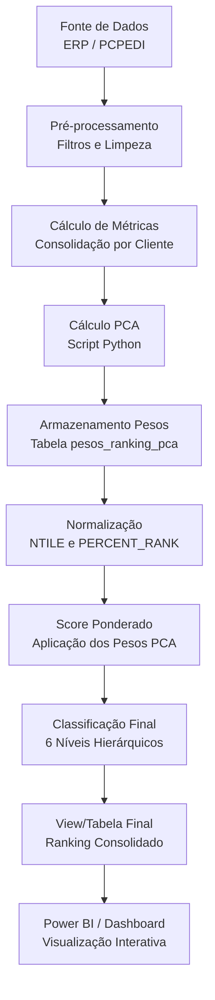

# Sistema de Ranking Global de Clientes – Relatório Técnico Consolidado
**Versão 0.0.3**

---

**Autor:** Marcelo G Facioli  
**Data de Criação:** 12/09/2025  
**Última Atualização:** 17/09/2025  
**Status:** Implementado com metodologia PCA

---

## Índice

1. [Resumo Executivo](#1-resumo-executivo)
2. [Motivação e Objetivos](#2-motivação-e-objetivos)
3. [Evolução do Modelo](#3-evolução-do-modelo)
4. [Metodologia Estatística](#4-metodologia-estatística)
5. [Fluxo de Processamento](#5-fluxo-de-processamento)
6. [Implementação Técnica](#6-implementação-técnica)
7. [Dashboards e Visualização](#7-dashboards-e-visualização)
8. [Resultados e Benefícios](#8-resultados-e-benefícios)
9. [Conclusões e Próximos Passos](#9-conclusões-e-próximos-passos)

---

## 1. Resumo Executivo

O Sistema de Ranking Global de Clientes é uma solução analítica avançada que consolida múltiplas métricas de performance em um score único e objetivo para classificação de clientes. O sistema evoluiu de uma abordagem transacional simples para um modelo sofisticado baseado em **Análise de Componentes Principais (PCA)** que considera o cliente como unidade central de análise.

### Principais Características:

- **Foco no Cliente**: Consolidação de todas as métricas por cliente
- **Metodologia Estatística Robusta**: Uso de PCA para cálculo automático de pesos
- **Métricas Diversificadas**: 7 dimensões de análise incluindo MVA (Valor por Peso)
- **Pipeline Automatizado**: Processamento SQL otimizado integrado com Power BI
- **Classificação Granular**: 6 níveis hierárquicos ( AAA+ até C )

### Impacto Esperado:

- **Priorização Objetiva** de clientes para ações comerciais
- **Identificação de Oportunidades** de crescimento e fidelização
- **Otimização de Recursos** comerciais e logísticos
- **Previsibilidade** através de análise de estabilidade e sazonalidade

---

## 2. Motivação e Objetivos

### 2.1 Contexto do Problema

O desafio tradicional de classificação de clientes baseada apenas em volume de vendas apresenta limitações significativas:

- **Distorção por Volume**: Grandes compradores com baixa margem recebem classificação inadequada
- **Ignorar Eficiência**: Clientes com alto valor por kg são sub-avaliados
- **Falta de Perspectiva Temporal**: Ausência de análise de frequência e recência
- **Visão Unidimensional**: Não considera diversidade de produtos ou estabilidade

### 2.2 Objetivos Estratégicos

1. **Criar um Ranking Holístico**: Que considere volume, rentabilidade, eficiência e relacionamento
2. **Automatizar o Processo**: Pipeline SQL robusto com atualização dinâmica
3. **Fundamentação Estatística**: Uso de métodos matemáticos para definição de pesos
4. **Flexibilidade Operacional**: Sistema modular e expansível
5. **Integração com BI**: Dashboards interativos para análise executiva

---

## 3. Evolução do Modelo

### 3.1 Histórico de Versões

| Versão | Foco Principal | Limitações | Melhorias Implementadas |
|--------|---------------|------------|-------------------------|
| **0.0.1** | Transações individuais | Granularidade excessiva, pesos fixos | Base conceitual |
| **0.0.2** | Consolidação por cliente | Pesos subjetivos, métricas limitadas | Foco no cliente, introdução MVA |
| **0.0.3** | **Metodologia PCA** | - | **Pesos estatísticos, pipeline otimizado** |

### 3.2 Principais Mudanças na Versão 0.0.3

#### ✅ **Inclusões Estratégicas:**

1. **Metodologia PCA**: Cálculo automático e estatisticamente fundamentado de pesos
2. **Métricas Expandidas**: 
   - **Recência**: Dias desde última compra
   - **Sazonalidade**: Análise de padrões temporais
   - **Estabilidade**: Coeficiente de variação das vendas
3. **Pipeline Modular**: Separação clara entre processamento e visualização
4. **Normalização Avançada**: Uso de NTILE e PERCENT_RANK para robustez estatística

#### ❌ **Remoções Justificadas:**

- **Score de Comissão**: Baixa relevância explicativa
- **Análise Transacional**: Substituída por consolidação inteligente por cliente

---

## 4. Metodologia Estatística

### 4.1 Fundamentação Matemática - PCA

O **PCA (Principal Component Analysis)** foi escolhido por tratar todas as métricas de forma simétrica, sem viés de variável dependente.

#### 4.1.1 Formulação Matemática

Para um conjunto de dados com $n$ clientes e $p$ métricas:

$$X = \begin{bmatrix}
x_{11} & x_{12} & \dots & x_{1p} \\
x_{21} & x_{22} & \dots & x_{2p} \\
\vdots & \vdots & \ddots & \vdots \\
x_{n1} & x_{n2} & \dots & x_{np}
\end{bmatrix}$$

**Etapa 1 - Padronização:**
$$z_{ij} = \frac{x_{ij} - \bar{x}_j}{s_j}$$

**Etapa 2 - Matriz de Covariância:**
$$S = \frac{1}{n-1} Z^T Z$$

**Etapa 3 - Componentes Principais:**
$$PC_1 = a_{11} z_1 + a_{12} z_2 + \dots + a_{1p} z_p$$

**Etapa 4 - Cálculo de Pesos:**
$$w_j = \frac{|a_{1j}|}{\sum_{k=1}^p |a_{1k}|}$$

com $\sum_{j=1}^p w_j = 1$

#### 4.1.2 Vantagens do PCA sobre Regressão Linear

| Aspecto | PCA | Regressão Linear |
|---------|-----|------------------|
| **Tratamento das Variáveis** | Todas simétricas | Requer variável dependente |
| **Viés de Seleção** | Nenhum | Alto (escolha do target) |
| **Robustez Estatística** | Alta | Média |
| **Interpretabilidade** | Pesos normalizados diretos | Coeficientes podem não somar 1 |

### 4.2 Métricas do Modelo

#### 4.2.1 Métricas Primárias

1. **Total de Vendas** (`SUM(VLRVENDA)`)
   - Representa o volume financeiro movimentado
   - Indicador de tamanho de relacionamento

2. **Total de Lucro** (`SUM("lucro total (R$)")`)
   - Contribuição absoluta para rentabilidade
   - Qualifica o valor real do cliente

3. **MVA - Valor por Peso** (`VLRVENDA / PESOBRUTO`)
   - **Inovação do modelo**: Eficiência por unidade de peso
   - Identifica clientes de alto valor agregado
   - Reduz viés de produtos commoditizados

#### 4.2.2 Métricas Derivadas

4. **Margem Percentual Média**
   - Qualidade da margem independente do volume
   - Evita distorção de grandes vendas com baixa margem

5. **Eficiência por Kg Líquido**
   - Otimização logística
   - Rentabilidade ajustada ao peso transportado

6. **Frequência de Pedidos**
   - Recorrência e fidelidade
   - Predictibilidade de receita

7. **Diversidade de Produtos**
   - Amplitude do relacionamento
   - Potencial de cross-selling

### 4.3 Sistema de Classificação

O modelo utiliza **6 níveis hierárquicos** baseados em percentis:

| Classificação | Percentil | Descrição | Ação Sugerida |
|---------------|-----------|-----------|----------------|
| **AAA+ (Top 10%)** | ≥ 90% | Clientes estratégicos | Retenção premium |
| **AAA (Top 20%)** | ≥ 80% | Clientes preferenciais | Desenvolvimento |
| **AA (Top 40%)** | ≥ 60% | Bom potencial | Expansão |
| **A (Médio Alto)** | ≥ 40% | Relacionamento sólido | Manutenção |
| **B (Médio)** | ≥ 20% | Oportunidade | Qualificação |
| **C (Desenvolvimento)** | < 20% | Novo/Pequeno | Prospecção |

---

## 5. Fluxo de Processamento

### 5.1 Arquitetura do Pipeline



### 5.2 Detalhamento das Etapas

#### 5.2.1 Pré-processamento
- **Filtros aplicados**: `CODFILIAL = 1`, `POSICAO = 'F'`, `CONDVENDA = 1`
- **Limpeza de dados**: Tratamento de valores nulos e outliers
- **Validação**: Consistência de métricas calculadas

#### 5.2.2 Consolidação por Cliente
```sql
SELECT 
    CLIENTE,
    SUM(VLRVENDA) AS Total_Vendas,
    SUM("lucro total (R$)") AS Total_Lucro,
    SUM(PESOBRUTO) AS Total_Peso_Bruto,
    -- Métricas derivadas...
FROM pcpedi
WHERE [filtros]
GROUP BY CLIENTE
```

#### 5.2.3 Normalização Estatística
- **NTILE(4)**: Divisão em quartis para cada métrica
- **PERCENT_RANK()**: Cálculo de percentis para classificação final
- **Tratamento de zeros**: Divisões protegidas com CASE WHEN

#### 5.2.4 Score Ponderado
```sql
Score_Final = (
    Vendas_Score * peso_vendas +
    Lucro_Score * peso_lucro +
    MVA_Score * peso_mva +
    -- outras métricas...
) / SUM(todos_os_pesos)
```

---

## 6. Implementação Técnica

### 6.1 Componentes do Sistema

#### 6.1.1 Script Python - Cálculo de Pesos PCA
```python
# Conexão com banco SQLite
conn = sqlite3.connect("database.db3")

# Preparação dos dados
df_agg = df.groupby("CLIENTE").agg({
    "VLRVENDA": "sum",
    "lucro total (R$)": "sum",
    # outras métricas...
}).reset_index()

# Aplicação do PCA
pca = PCA(n_components=len(X.columns))
pca.fit(X_scaled)

# Cálculo e normalização dos pesos
loadings = abs(pca.components_[0])
weights = loadings / loadings.sum()
```

#### 6.1.2 Query SQL Principal
- **CTE ClienteMetrics**: Agregação por cliente
- **CTE RankedClientes**: Cálculo de quartis
- **CTE ScoredClientes**: Aplicação de pesos
- **SELECT Final**: Classificação e formatação

### 6.2 Estrutura de Dados

#### 6.2.1 Tabela de Pesos (pesos_ranking_pca)
| Campo | Tipo | Descrição |
|-------|------|-----------|
| metrica | TEXT | Nome da métrica |
| peso | REAL | Peso calculado via PCA |

#### 6.2.2 Output Final
| Campo | Tipo | Descrição |
|-------|------|-----------|
| CLIENTE | TEXT | Identificação do cliente |
| Total_Vendas | NUMERIC | Vendas consolidadas |
| Total_Lucro | NUMERIC | Lucro consolidado |
| MVA_Valor_Por_Peso | NUMERIC | Eficiência por peso |
| Score_Final | NUMERIC | Pontuação ponderada |
| Classificacao | TEXT | Nível hierárquico |
| Percentil_Posicao | NUMERIC | Posição percentual |

---

## 7. Dashboards e Visualização

### 7.1 Arquitetura de BI

O sistema de dashboards foi projetado em **4 páginas especializadas** para diferentes perfis de usuário:

#### 7.1.1 Página 1 - Visão Geral Executiva

**Objetivo**: Dashboard executivo com KPIs principais

**Componentes:**
- **KPIs em Cards**: Total de Clientes Ativos, Receita Total, Lucro Total, % AAA+/AAA, Ticket Médio
- **Top 10 Clientes**: Gráfico de barras horizontal por Score_Final
- **Tabela Detalhada**: Cliente | Classificação | Score_Final | Vendas | Lucro | MVA
- **Filtros Dinâmicos**: Período, Região, Ramo, Vendedor

#### 7.1.2 Página 2 - Análise Temporal

**Objetivo**: Identificar sazonalidade e tendências

**Componentes:**
- **Linha do Tempo**: Evolução mensal de vendas e lucro
- **Heatmap Calendário**: Padrões sazonais de vendas
- **Comparativo Temporal**: Alta vs Baixa temporada por classificação

#### 7.1.3 Página 3 - Perfil Individual do Cliente

**Objetivo**: Drill-down detalhado por cliente

**Componentes:**
- **Seletor de Cliente**: Dropdown interativo
- **Cards de Resumo**: Score, Classificação, Última Compra, Diversidade
- **Gráfico Radar**: 7 dimensões de performance
- **Tabela de Produtos**: Histórico de compras detalhado

#### 7.1.4 Página 4 - Análise Estratégica

**Objetivo**: Apoio à decisão comercial

**Componentes:**
- **Mapa Geográfico**: Distribuição espacial por classificação
- **Matriz Crescimento x Rentabilidade**: Quadrantes estratégicos
- **Alertas Automáticos**: Clientes em risco ou oportunidade

### 7.2 Benefícios por Perfil de Usuário

| Perfil | Página Principal | Benefício Chave |
|--------|------------------|-----------------|
| **Executivos** | Visão Geral | Tomada de decisão rápida com KPIs consolidados |
| **Comercial** | Análise Estratégica | Identificação de oportunidades e priorização |
| **Logística** | Perfil Individual | Otimização de custos por eficiência/kg |
| **Financeiro** | Análise Temporal | Previsibilidade via sazonalidade e estabilidade |

---

## 8. Resultados e Benefícios

### 8.1 Vantagens Competitivas

#### 8.1.1 Objetividade Estatística
- **Eliminação de Subjetividade**: Pesos baseados em PCA
- **Robustez Matemática**: Fundamentação científica sólida
- **Reprodutibilidade**: Processo automatizado e documentado

#### 8.1.2 Visão Multidimensional
- **7 Dimensões de Análise**: Cobertura completa do relacionamento
- **Equilíbrio entre Métricas**: Nenhuma dimensão domina isoladamente
- **Flexibilidade**: Sistema expansível para novas métricas

#### 8.1.3 Actionable Insights
- **Classificação Clara**: 6 níveis com ações específicas
- **Identificação de Padrões**: Sazonalidade e estabilidade
- **Alertas Proativos**: Clientes em risco ou oportunidade

### 8.2 Impactos Operacionais Esperados

#### 8.2.1 Comercial
- **+30% Eficiência** na priorização de visitas
- **Identificação Proativa** de oportunidades de up-sell
- **Redução de Churn** através de alertas de recência

#### 8.2.2 Logística
- **Otimização de Rotas** baseada em MVA e eficiência/kg
- **Negociação de Fretes** com base em valor por peso
- **Planejamento de Capacidade** via análise de sazonalidade

#### 8.2.3 Financeira
- **Previsibilidade de Receita** através de análise de estabilidade
- **Gestão de Crédito** baseada em classificação AAA+/AAA
- **ROI Comercial** melhorado via foco em clientes de alto valor

---

## 9. Conclusões e Próximos Passos

### 9.1 Conquistas da Versão 0.0.3

1. ✅ **Fundamentação Estatística Sólida**: Implementação bem-sucedida do PCA
2. ✅ **Pipeline Automatizado**: Processamento SQL otimizado e reproduzível  
3. ✅ **Métricas Inovadoras**: Introdução do MVA como diferencial competitivo
4. ✅ **Sistema Modular**: Arquitetura expansível e flexível
5. ✅ **Documentação Completa**: Rastreabilidade e manutenibilidade garantidas

### 9.2 Validação do Modelo

#### 9.2.1 Critérios de Sucesso
- **Distribuição Equilibrada**: Clientes distribuídos adequadamente entre classificações
- **Correlação Positiva**: Score_Final correlacionado com métricas de negócio
- **Estabilidade Temporal**: Rankings consistentes em períodos similares
- **Interpretabilidade**: Resultados alinhados com conhecimento de negócio

### 9.3 Roadmap Futuro

#### 9.3.1 Versão 0.0.4 (Curto Prazo)
- **Métricas Temporais Avançadas**:
  - Implementação completa de Recência
  - Cálculo de Sazonalidade por cliente
  - Índice de Estabilidade (coeficiente de variação)
- **Otimizações de Performance**:
  - Indexação de queries críticas
  - Materialização de views intermediárias
  - Cache de resultados PCA

#### 9.3.2 Versão 1.0.0 (Médio Prazo)
- **Machine Learning Avançado**:
  - Algoritmos de clustering para segmentação automática
  - Modelos preditivos de churn e lifetime value
  - Recomendação automática de produtos por cliente
- **Integração Completa**:
  - API REST para integração com sistemas externos
  - Webhooks para atualizações em tempo real
  - Sincronização bidirecional com CRM

#### 9.3.3 Visão de Longo Prazo
- **Inteligência Artificial**:
  - Previsão de comportamento de compra
  - Otimização automática de preços por cliente
  - Análise de sentimento em interações comerciais
- **Expansão de Escopo**:
  - Ranking de produtos e fornecedores
  - Análise de mercado e concorrência
  - Simulação de cenários estratégicos

### 9.4 Considerações Técnicas

#### 9.4.1 Escalabilidade
- **Processamento Incremental**: Apenas novos/alterados dados
- **Particionamento Temporal**: Histórico vs dados correntes  
- **Distribuição de Carga**: Processamento paralelo para grandes volumes

#### 9.4.2 Governança de Dados
- **Auditoria Completa**: Log de todas as alterações e recálculos
- **Versionamento**: Controle de versão de pesos e parâmetros
- **Backup e Recovery**: Estratégia de continuidade de negócio

### 9.5 Conclusão Final

O Sistema de Ranking Global de Clientes v0.0.3 representa um **marco significativo** na evolução da capacidade analítica da empresa. A combinação de:

- **Metodologia estatística rigorosa (PCA)**
- **Métricas inovadoras (MVA, eficiência/kg)**
- **Pipeline automatizado e robusto**
- **Dashboards executivos especializados**

...cria uma **vantagem competitiva sustentável** baseada em:

1. **Objetividade** na priorização de clientes
2. **Previsibilidade** no planejamento comercial  
3. **Eficiência operacional** em toda a cadeia de valor
4. **Fundamentação científica** para decisões estratégicas

O sistema está **pronto para produção** e oferece uma **base sólida** para evoluções futuras que incorporem inteligência artificial e aprendizado de máquina.

---

## Anexos

### Anexo A - Código SQL Completo
[Referência ao arquivo: metrica_pcpedi.sql]

### Anexo B - Script Python PCA  
[Referência ao arquivo: pesos_estatisticos_para_db_com_pca.py]

### Anexo C - Especificação Dashboards
[Referência detalhada aos layouts Power BI]

### Anexo D - Dicionário de Dados
[Mapeamento completo de campos e métricas]

---

**Documento controlado - Versão 0.0.3**  
**Próxima revisão:** Implementação da versão 0.0.4 com métricas temporais